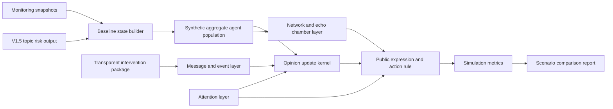

# Sentigraph Simulation Lab Design

Status: design foundation only. No product code, real API calls, real LLM calls, live public fetching, or manipulation tactics are implemented by this document.

This document converts the uploaded DeepSearch Simulation Lab research report into a formal architecture plan for an ethical public opinion simulation and scenario-prehearsal module.

## Purpose

Simulation Lab is intended to help teams compare transparent, legitimate crisis-response options before they act in public. It should answer questions such as:

- If we publish a clarification now, which aggregate risk indicators may improve or worsen?
- If we add an apology, compensation, FAQ, progress update, or third-party evidence, how might aggregate topic risk and attention evolve?
- Which assumptions drive the forecast most strongly?
- Where is the model uncertain, and where should monitoring continue instead of acting on a simulated result?

Simulation Lab is not a persuasion optimizer. It must not generate or recommend covert influence operations, fake consensus, bot amplification, deceptive distraction, harassment, or individual-level targeting.

## Ethical Scope

Allowed scope:

- Aggregate-level comparison of transparent response packages.
- Aggregate-level comparison of lawful, platform-authorized, policy-based content moderation actions.
- Synthetic or sanitized scenario rehearsal.
- Crisis communication planning that is factual, accountable, and reviewable.
- Model outputs with uncertainty labels and assumption logs.
- Human-reviewed recommendations that can be traced to model assumptions.

Out of scope:

- Account-level influenceability scoring.
- Individual persuasion targeting.
- Microtargeted emotional manipulation.
- Fake events, fake consensus, fake supporters, or covert influencer seeding.
- Bot amplification, sockpuppets, astroturfing, illegal suppression, covert censorship, harassment, or deceptive attention diversion.

The ethics rules are expanded in [simulation_ethics.md](simulation_ethics.md).

## Relationship to Existing Sentigraph Modules

Simulation Lab should sit after the current monitoring, risk scoring, forecasting, and reporting layers.

- Monitoring snapshots provide historical aggregate states: risk scores, topic risks, alert history, and attention movement.
- The V1.5 topic risk model provides baseline topic severity, real-crisis risk, manipulation risk, and top-risk topic structure.
- The current forecasting module remains a deterministic trend extrapolation from existing snapshots.
- Simulation Lab adds counterfactual scenario comparison: "What may happen if a transparent intervention package is introduced?"
- Reports can summarize scenario assumptions, aggregate outcomes, and recommended transparent response plans.
- Offline benchmarks should validate toy simulator behavior before any real-data or real-LLM integration is considered.

Simulation Lab must not replace current monitoring or forecasting. It should be labeled as an assumption-based scenario rehearsal layer.

## Hybrid Agent-Based Architecture

The MVP architecture should be a deterministic hybrid agent-based model with swappable modules. The goal is interpretability and validation, not black-box optimization.

### Agent Layer

Agents represent synthetic aggregate personas, not real accounts or identifiable people.

Core agent variables:

- `latent_opinion`: private stance or risk perception.
- `expressed_opinion`: public-facing stance after social pressure and action thresholds.
- `stubbornness`: persistence of initial opinion.
- `confirmation_bias`: tendency to overweight congenial messages.
- `motivated_reasoning`: tendency to discount conflicting evidence.
- `negativity_weight`: sensitivity to negative or high-threat information.
- `reactance`: resistance when a message feels coercive.
- `authority_trust`: trust in official, media, third-party, or peer sources.
- `conformity`: sensitivity to perceived local majority.
- `identity_vector`: synthetic group identity coordinates.
- `attention_budget`: amount of attention available for the topic.
- `fatigue`: declining willingness to engage after repeated exposure.
- `action_threshold`: threshold for public expression, sharing, commenting, or correction uptake.
- `confidence_radius`: bounded-confidence radius for accepting neighbor influence.

MVP agents should be generated synthetically from scenario parameters. No real user profiles should be used.

### Network Layer

The network layer models aggregate exposure patterns and opinion bubbles.

MVP network features:

- Homophilous static network.
- Bounded-confidence interaction gates.
- Local clusters with bridge nodes.
- `bridge_score` for cross-cluster connectors.
- `cross_cutting_exposure_rate` for exposure outside the local opinion bubble.
- Platform-neutral feed visibility weights.

Later versions can add dynamic rewiring, cross-platform diffusion, and platform-specific affordance calibration after validation.

### Echo Chamber and Opinion Bubble Model

The echo chamber model combines:

- Homophily: similar agents are more likely connected.
- Bounded confidence: agents primarily update from views within an acceptable radius.
- Confirmation bias: congenial messages receive more weight.
- Cross-cutting exposure: bridge nodes and feed policies introduce some outside views.
- Attention decay: even high-risk topics fade without new events.

The model should report bubble-level metrics rather than individual targets:

- Polarization.
- Opinion entropy.
- Cross-cutting exposure.
- Bridge exposure.
- Narrative dominance.
- Correction uptake by aggregate segment.

### Message and Event Layer

Messages and events represent public claims, corrections, updates, apologies, compensation offers, or third-party evidence.

Core message variables:

- `source_type`.
- `source_credibility`.
- `evidence_strength`.
- `framing`.
- `stance_direction`.
- `emotional_valence`.
- `specificity`.
- `identity_affirmation`.
- `autonomy_threat`.
- `novelty`.
- `repetition_signature`.
- `platform_affordance`.
- `visibility_seed`.

The MVP should include transparent response messages only. It must not include covert seeding, fake events, fabricated supporters, or bot-like repetition tactics.

### Attention Layer

The attention layer models public attention as limited, decaying, and sensitive to shocks.

MVP attention features:

- Exponential attention decay.
- New-event shock.
- Fatigue after repeated exposure.
- Competition between topics.
- Conservative uncertainty label when attention behavior is poorly supported.

Future versions may add Hawkes-style self-exciting bursts after historical validation.

### Intervention Layer

Interventions are transparent, reviewable response packages.

Allowed intervention types:

- Clarification.
- FAQ.
- Apology.
- Compensation.
- Progress update.
- Third-party evidence.
- Misinformation correction.
- Prebunking or inoculation.
- Lawful/platform-authorized content moderation and visibility interventions when they are based on explicit policy and are reviewed.

Each intervention should carry:

- `intervention_type`.
- `responsible_party`.
- `transparency_label`.
- `evidence_strength`.
- `empathy_level`.
- `responsibility_admission`.
- `compensation_offer`.
- `third_party_verification`.
- `publication_cadence`.
- `target_scope`, limited to aggregate audience or topic segment.

The system should compare intervention packages; it should not optimize manipulative tactics.

### Content Moderation and Visibility Intervention Layer

Simulation Lab should also model lawful, platform-authorized, policy-based moderation actions as legitimate scenario variables. These actions are not deceptive manipulation when they are grounded in platform rules, legal process, safety policy, or account/content governance, and when the simulator treats them as auditable interventions with tradeoffs.

Supported moderation and visibility intervention types:

- `content_removal`: removal of a specific policy-violating content item or content class.
- `comment_closure`: closing or limiting comments on a thread, post, or aggregate scenario surface.
- `account_restriction`: platform-authorized restriction of accounts that violate policy, modeled only at aggregate cohort level.
- `visibility_reduction`: reduced ranking, reach, recommendation, or distribution for policy-violating or low-integrity content.
- `platform_labeling`: adding context, warning, fact-check, disputed-content, or policy labels.
- `policy_enforcement_notice`: transparent explanation that a moderation action was taken under a specific policy.

The model should evaluate tradeoffs rather than assume moderation is always beneficial. Key variables:

- `target_message_reach`: estimated current reach of the content or message being moderated.
- `residual_copies`: estimated remaining copies, mirrors, screenshots, or reposts after an action.
- `screenshot_probability`: chance that users preserve and recirculate the original content.
- `repost_migration_probability`: chance that discussion migrates to another thread, platform, or community.
- `perceived_suppression`: aggregate perception that the action is unfair or censorial.
- `policy_violation_clarity`: how clear and explainable the policy violation is.
- `legitimacy_of_removal`: aggregate legitimacy score based on policy clarity, evidence, and process.
- `public_explanation_quality`: quality of the notice or explanation accompanying enforcement.
- `reactance_amplification`: increase in resistance caused by perceived restriction.
- `martyr_effect`: risk that the removed/restricted actor or content gains symbolic support.
- `cross_platform_spillover`: likelihood that attention moves to other platforms or communities.
- `neutral_audience_negative_shift`: modeled negative shift among neutral observers.
- `hard_opposition_negative_shift`: modeled negative shift among already opposed groups.

Moderation scenarios should compare actions such as:

- no response
- clarification only
- labeling plus clarification
- removal without explanation
- removal plus transparent policy explanation
- comment closure plus progress update

Allowed outputs are aggregate tradeoff metrics:

- `exposure_reduction`
- `backlash_cost`
- `trust_loss`
- `spillover_risk`
- `net_risk_change`
- `removal_legitimacy_score`
- `neutral_audience_impact`
- `opposition_group_impact`

Forbidden moderation modeling:

- illegal suppression
- covert censorship
- targeting named individuals for silencing
- evading platform governance
- manufacturing fake consensus after removal
- using bot amplification to bury criticism
- deceptive attention diversion from the moderated issue

Moderation modeling should help users decide whether a lawful enforcement action needs explanation, whether labeling may be less risky than removal, or whether a removal may reduce exposure while increasing backlash. It must not produce harassment lists, suppression playbooks, or evasion tactics.

## Output Metrics

MVP output metrics should be aggregate, explainable, and uncertainty-labeled:

- Predicted aggregate risk score.
- Risk level.
- Real-crisis risk.
- Manipulation-risk indicator, where relevant.
- Topic-level risk movement.
- Polarization.
- Opinion entropy.
- Narrative dominance.
- Sentiment volatility.
- Correction uptake.
- Trust recovery.
- Attention half-life.
- Cross-cutting exposure.
- Intervention harm warning.
- Ethical-risk score.
- Assumption sensitivity.
- Exposure reduction, when moderation or visibility interventions are simulated.
- Backlash cost.
- Trust loss.
- Spillover risk.
- Net risk change.
- Removal legitimacy score.
- Neutral audience impact.
- Opposition group impact.

No output should identify individual users, recommend account-level persuasion targets, or rank vulnerable groups by influenceability.

## Swappable Strategy Modules

Simulation Lab should keep these modules interchangeable:

- Opinion kernel: DeGroot, Friedkin-Johnsen, Hegselmann-Krause, or Deffuant-Weisbuch.
- Action rule: simple threshold, Granovetter threshold, Watts cascade, or complex contagion.
- Attention model: exponential decay, trend decay, or Hawkes-style burst envelope.
- Intervention model: SCCT, Image Repair, correction-only, or hybrid evidence-first packages.

Swappability helps validation and prevents the module from becoming an opaque optimization oracle.

## MVP Boundary

The first implementation should be a deterministic toy simulator:

- Offline only.
- Synthetic agents only.
- No real platform calls.
- No real LLM calls.
- No live public fetching.
- No persuasion targeting.
- No manipulation tactics.
- Content moderation simulations must remain lawful, policy-based, transparent, and aggregate-level.
- Benchmark-first validation.

Implementation should not begin until the ethics, validation, and benchmark acceptance criteria are reviewed.
